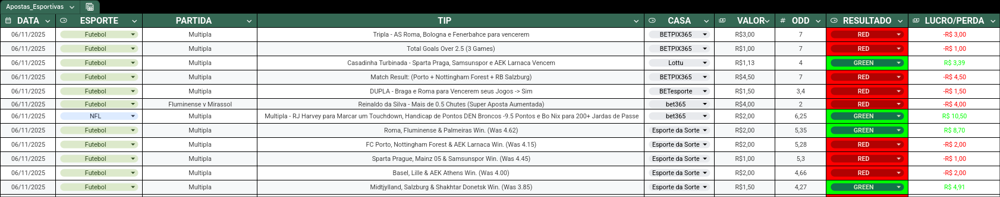

---

<p align="center">
  
  
  
  
</p>

<h1 align="center">🧠 Extrator-Apostas-AI</h1>
<p align="center">
  Extrai texto de imagens de apostas e exporta para CSV pronto para planilhas.
</p>

---

## 📚 Sumário

- [🧩 Sobre o Projeto](#-sobre-o-projeto)
- [🚀 Funcionalidades](#-funcionalidades)
- [⚠️ Aviso Importante](#️-aviso-importante)
- [🧰 Pré-requisitos](#-pré-requisitos)
- [🛠️ Instalação](#️-instalação)
- [▶️ Como Usar](#️-como-usar)
- [📜 Licença](#-licença)

---

## 🧩 Sobre o Projeto

O **Extrator-Apostas-AI** é um script Python que utiliza a **API do Google Gemini** para **identificar e extrair informações de screenshots de apostas esportivas**.

Ele foi criado para **automatizar o processo de registro de apostas**, gerando um arquivo `.csv` limpo, pronto para ser importado em uma planilha de controle.

> 💡 Ideal para quem gerencia várias apostas e deseja manter o controle organizado sem precisar digitar manualmente.

---

## 🚀 Funcionalidades

| Função | Descrição |
|--------|------------|
| 🖼️ **Processamento em Lote** | Processa automaticamente todas as imagens da pasta `imagens/`. |
| 🎯 **Extração Múltipla** | Lê e separa múltiplas apostas de um único screenshot. |
| ⚙️ **Failover de Modelos** | Alterna entre `gemini-2.5-flash` e `gemini-2.5-pro` para evitar limites de taxa e garantir velocidade. |
| 📂 **Gerenciamento de Arquivos** | Move imagens processadas para `imagens_processadas/` evitando duplicação. |
| 📊 **Saída Padronizada** | Gera `NOVAS_APOSTAS.csv` limpo, pronto para planilhas (começando na coluna B). |
| 🏷️ **Classificação Automática** | Classifica esportes em “Futebol”, “Basquete”, “NFL” ou “Outros”. |

---

## ⚠️ Aviso Importante

Este projeto foi desenvolvido para funcionar **somente com a planilha-exemplo oficial** (ou uma que siga a mesma estrutura).

A ordem de colunas esperada é: **[COLUNA VAZIA (A)] – DATA – ESPORTE – PARTIDA – TIP – CASA – VALOR – ODD – RESULTADO – LUCRO/PERDA**

---

## 🧰 Pré-requisitos

- **[Python 3.7+](https://www.python.org/downloads/)**  
  Certifique-se de que o Python está instalado e acessível pelo terminal (verifique com `python --version`).

- **[Git](https://git-scm.com/downloads)**  
  Necessário para clonar o repositório e gerenciar versões do projeto.

- **[Chave de API do Google Gemini](https://aistudio.google.com/app/apikey)**  
  Requer uma conta no Google AI Studio para acessar os modelos `gemini-2.5-flash` e `gemini-2.5-pro`.


---

## 🛠️ Instalação

### 1️⃣ Clonar o repositório

Bash

```
git clone https://github.com/AugustodoBRT/extrator-apostas-AI.git
cd extrator-apostas-AI
```

### 2️⃣ Instalação Automática (Recomendada)

Estes scripts criam o ambiente virtual (`.venv`) e instalam todas as dependências automaticamente.

**No Linux / macOS:**

Bash

```
# Adiciona permissão de execução
chmod +x install.sh
# Executa a instalação
./install.sh
```

**No Windows:**

Bash

```
# Dê um duplo-clique no arquivo 'install.bat'.
# Ou execute no prompt de comando:
.\install.bat
```

_(Após a instalação, o terminal instruirá você a editar o `rodar.sh` ou `rodar.bat` com sua chave de API.)_

### 3️⃣ Instalação Manual

Use esta opção se a instalação automática falhar.

**A. Criar e Ativar o Ambiente Virtual**

Bash

```
# Linux / macOS
python3 -m venv .venv
source .venv/bin/activate
```

Bash

```
# Windows
python -m venv .venv
.\.venv\Scripts\activate
```

**B. Instalar Dependências**

Bash

```
pip install -r extrator/requirements.txt
```

**C. Criar Pastas de Trabalho (ou usar as do repositório)**

Bash

```
mkdir imagens imagens_processadas
```

### 4️⃣ Adicionar a chave da API

Após a instalação, você deve editar o script lançador:

**Linux / macOS:**

Bash

```
nano linux.sh
Edide a linha
export GOOGLE_API_KEY="SUA_CHAVE_AQUI"
```

**Windows:**

Bash

```
notepad windows.bat
set "GOOGLE_API_KEY=SUA_CHAVE_AQUI"
```

---

## ▶️ Como Usar

1. Coloque seus screenshots de apostas em `imagens/`.
    
2. Execute o script no terminal:
    
        Linux / macOS: ./rodar.sh
    
        Windows: rodar.bat
    
3. O script processará as imagens e criará o arquivo NOVAS_APOSTAS.csv.
    
4. Importe-o para sua planilha conforme as instruções acima.
    
📥 **Planilha Exemplo:** `exemplo_planilha.xlsx` (inclusa no repositório)

### 🧾 Importando o CSV

- **Google Sheets (recomendado)**:
  1. Antes de adicionar um CSV novo, SEMPRE clique na celula abaixo da ultima importada (ou se for a primeira em baixo da DATA) e que seja na coluna A (O CSV sempre importa pulando a primeira coluna(A))
  2. Abra a planilha-exemplo no Google Sheets.  
  3. **Arquivo → Importar → Upload**.  
  4. Selecione `NOVAS_APOSTAS.csv`.  
  5. Em **Importar dados**, escolha:
     - **Replace data at selected cell**  
     - **Separator type:** `Comma`  
  6. Clique em **Importar dados**.

- **Excel / LibreOffice**:
  1. Abra `NOVAS_APOSTAS.csv`.  
  2. **Copie apenas as linhas de dados** (sem o cabeçalho).  
  3. Cole na sua planilha principal, a partir da **coluna B (DATA)**.  
  4. Apague o CSV após importar para que o próximo processamento gere um arquivo limpo.

> Observação: o Google Sheets importa melhor quando você usa **Replace data at selected cell** com **Comma**. Se usar outro modo, confira separador e localização antes de substituir dados.

Exemplo de Planilha utilizando o extrator:

<p align="center">
  
</p>

---

## 📜 Licença

Distribuído sob a licença **MIT**.

---
